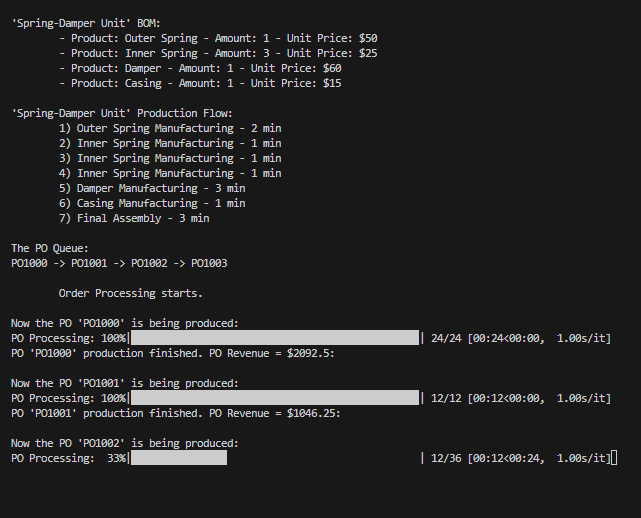
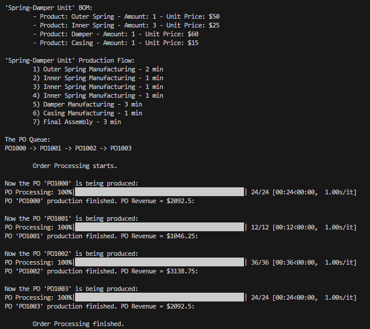

# Project: Production Order System with Production Time Simulation

## Project Description:

The production order system simulates the processing of production orders in a manufacturing setting. 
Each order consists of multiple final product items, and each final product item is consisted of more components of specific amount.
Furthermore, there are multiple production processes to execute for building the final product, each requiring specific product(s) 
and having an associated production time. The system manages the queue of production orders and simulates the production process 
by waiting for the appropriate amount of time before processing each order. The tqdm module aids the visibility of production 
processes and PO processing. 

## Project Goals:

- Develop a Python program to simulate the processing of production orders.
- Implement a queue data structure to manage the order queue.
- Calculate the production time for each order based on the amount of final products in the order.
- Use OOP to build the final product and production logics.
- Allow display of BOM and Production Flow for a final product.
- Simulate the production process by waiting for the appropriate amount of time before processing each order.
- Provide an understandable way to show progress of PO processing with tqdm module.

## Libraries used

- tqdm

## Screenshots

*Progress of PO Processing*

*Project results*